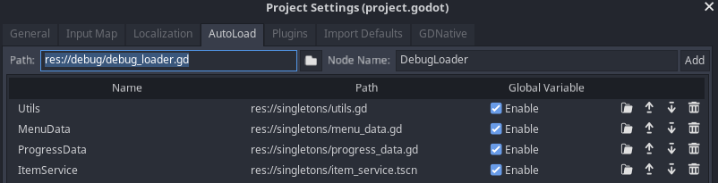
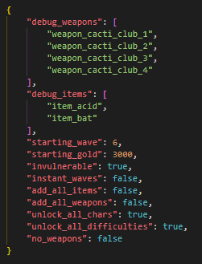
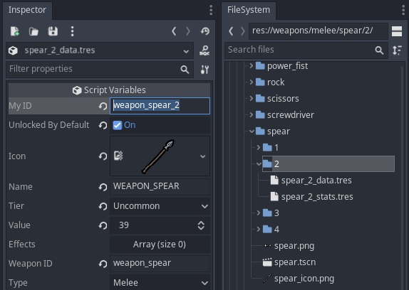

# Brotato DebugLoader 1.0.2

_Get the mod files from the `debug` folder._

## Overview

Set debug options via a JSON file, including initial weapons and items, starting wave, and materials.

Developed to help modders test different weapons, items and builds.

Works with dami's multi mod support (autoload that first, before this).

* [Details](#details)
* [Usage](#usage)
  * [Add the framework to an existing mod](#add-the-framework-to-an-existing-mod)
  * [Using debug.json](#using-debugjson)
* [Options](#options)
  * [Available Options](#available-options)
  * [Weapons &amp; Items](#weapons--items)
  * [IDs](#IDs)
* [Notes](#notes)
  * [Validation](#validation)
  * [Default debug.json](#default-debugjson)
  * [debug_service](#debug_service)
  * [Links](#links)
  * [Credits](#credits)

## Usage

### Add the framework to an existing mod

* Add **debug_loader.gd** to your project, in a folder named `debug`
* Add it to your autoloads:
  * Project > Project Settings > Autoload
  * Click the little folder icon at the top to locate this file
  * Leave the name as `DebugLoader`
  * Make sure it's below dami's multiple mod support script (if applicable)

### Using debug.json

* Backup your save, just in case
* Put *debug.json* in a folder named `debug` in the game folder
* Edit *debug.json* and start the game

As the *debug.json* file has its own folder, you can keep as many *debug.json* variants as you need, swapping between them for different test setups.

## Options

### Available Options

| Option                  | Type  | Default | Notes                                   |
| ----------------------- | ----- | ------- | --------------------------------------- |
| debug_weapons           | array | `[]`    | Set your starting weapons (see below)   |
| debug_items             | array | `[]`    | Set your starting items (see below)     |
| starting_wave           | int   | `1`     | Sets initial wave. Supports `1` - `21`  |
| starting_gold           | int   | `30`    | Sets initial materials                  |
| invulnerable            | bool  | `false` | Disables your hurtbox                   |
| instant_waves           | bool  | `false` | Waves only last 1 second (good for checking rarer shop items) |
| add_all_items           | bool  | `false` | Adds every item to your character       |
| add_all_weapons         | bool  | `false` | Adds every weapon (can go over limit)   |
| unlock_all_chars        | bool  | `false` | Unlocks all characters (temporary?)     |
| unlock_all_difficulties | bool  | `false` | Unlocks all danger levels (temporary?)  |
| no_weapons              | bool  | `false` | Removes all weapons at the start of every wave |

### Weapons & Items

Add an array of weapon/item IDs to start with them. You **can** go over the weapon limit.

#### Weapons

	"debug_weapons": [
		"weapon_spear_1",
		"weapon_spear_2",
		"weapon_spear_3",
		"weapon_spear_4",
	],

#### Items

	"debug_items": [
		"item_acid",
		"item_bat"
	],

### IDs

You can find the IDs in the project in Godot, in each tier's `*_data.tres` file.

- For example, you'll find the ID for *Spear/Tier 2* here: `res://weapons/melee/spear/2/spear_2_data.tres`

The weapon/item ID is called **My ID** in the Inspector.

If you're using **dami's multiple mod support**, your can also use IDs for custom weapons and items. (Just make sure this script is below the multi mod in the autoload settings.)

## Notes

### Validation

Warning: Currently has no validation or checks to ensure JSON keys are all present and valid. If debug.json exists, the code expects it to be correct.

Godot isn't great with informative crash reports, so invalid or malformed JSON could cause a crash with no additional info. You can use [jsonlint.com](https://jsonlint.com) if you need to find issues in your JSON.

### Default debug.json

By default, debug.json looks like this, using values from vanilla:

	{
		"debug_weapons": [],
		"debug_items": [],
		"starting_wave": 1,
		"starting_gold": 30,
		"invulnerable": false,
		"instant_waves": false,
		"add_all_items": false,
		"add_all_weapons": false,
		"unlock_all_chars": false,
		"unlock_all_difficulties": false,
		"no_weapons": false
	}

### debug_service

These options can also be set in Godot, with **debug_service.tscn**:

- In the Filesystem tab: *singletons/debug_service.tscn*,
- In the Scene tab, click the DebugService node,
- In the Inspector tab, edit the settings.

The option `unlock_all_challenges` is intentionally left out of this script because it affects permanent unlocks. All other options are temporary.

### Links

DebugLoader:

* Wiki: [Mod:DebugLoader](https://brotato.wiki.spellsandguns.com/Mod:DebugLoader) *(pending)*
* Repo: [ithinkandicode/Brotato-DebugLoader](https://github.com/ithinkandicode/Brotato-DebugLoader)

More mods from Darkly77:

- [Deadbolt (DCP/DECP)](https://deadbolt.codemuffin.com)
- [Nexus Mods](https://www.nexusmods.com/20minutestildawn/users/73115203?tab=user+files&BH=0)
- [Steam Workshop](https://steamcommunity.com/id/darkly77/myworkshopfiles/)

### Credits

Made by Darkly77.

Massive thank you to dami, who figured out how to fix a critical bug in Godot that broke the weapons/items arrays.
